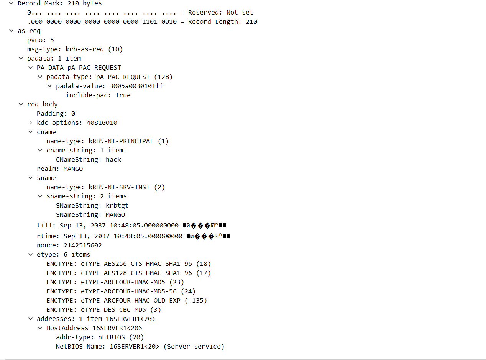
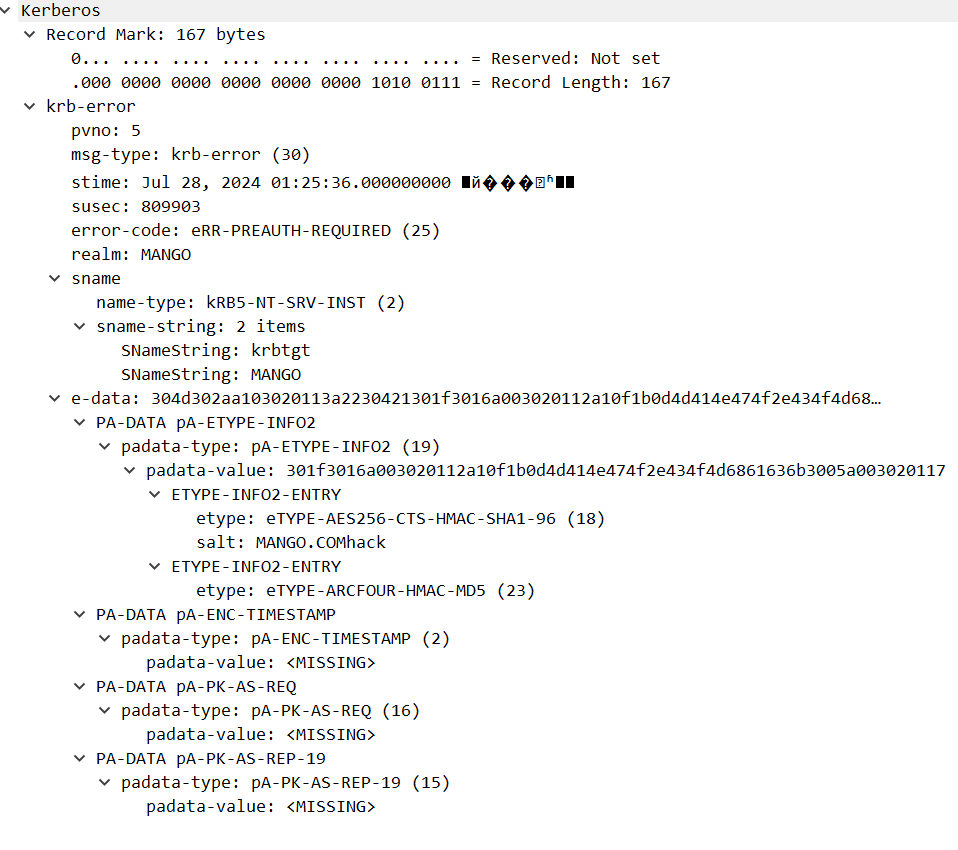
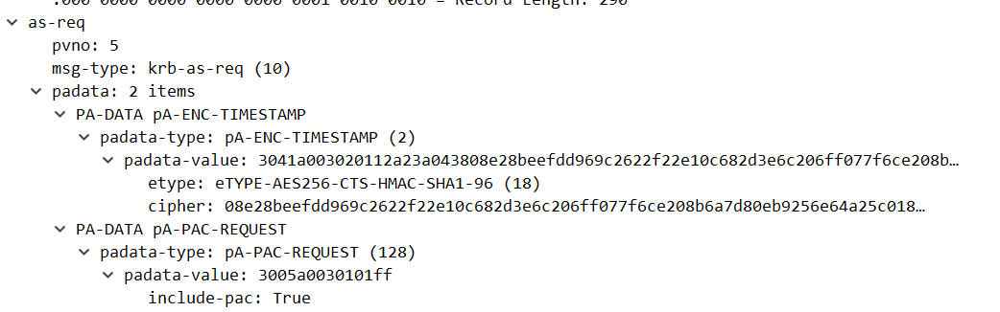
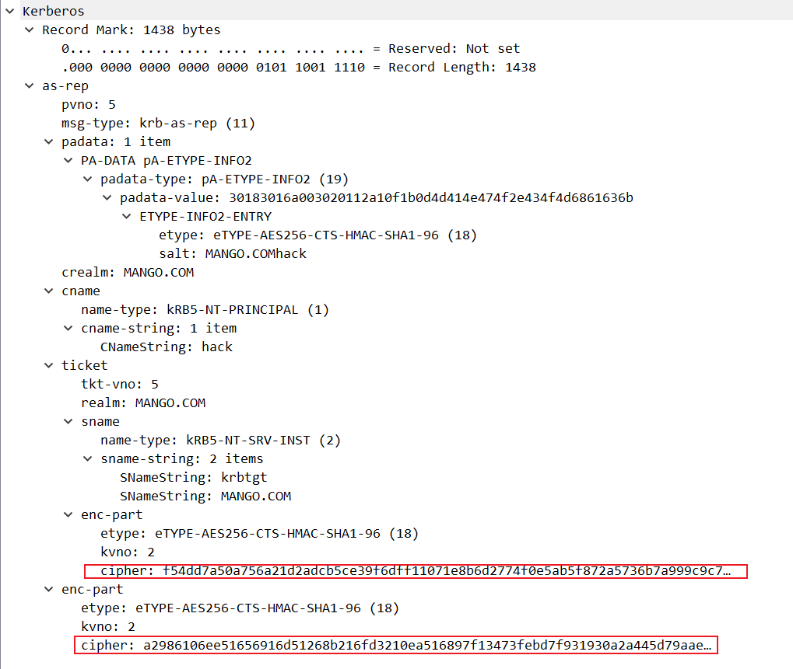
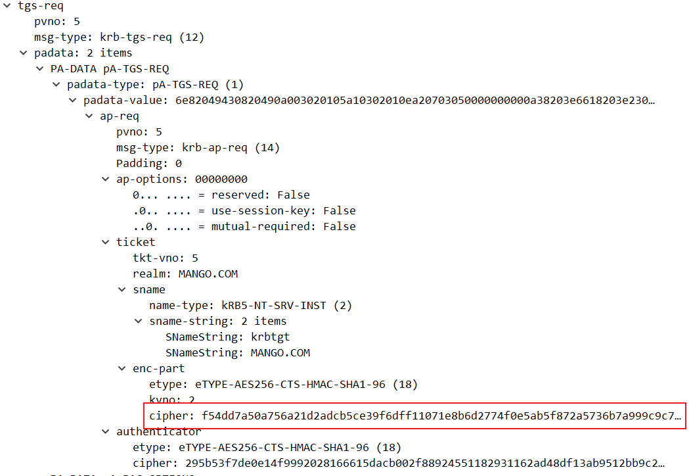
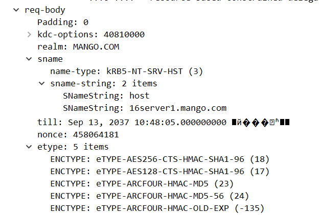
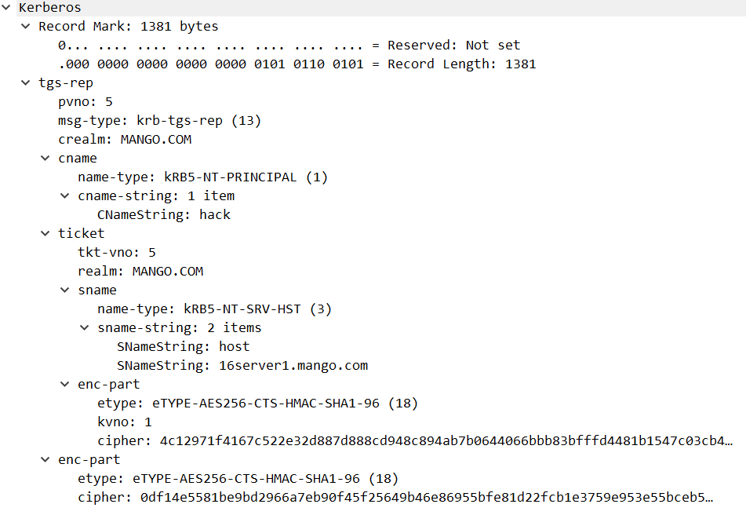

# Kerberos分析

# kerberos 分析

kerberos 的主要步骤如下，重点分析前四步
1. AS-REQ
2. AS-REP
3. TGS-REQ
4. TGS-REP
5. AP-REQ
6. AP-REP

##  AS-REQ

在域控上抓包，查看机器登陆域用户时产生的流量

发现AS-REQ会进行两次，原因是开启了域身份验证，第一次的AS-REQ相比第二次会少一部分

先看这一部分

pvno：5 代表 kerberos 协议的版本号

msg-type 是消息类型

padata：1 item 代表有一个数据项

padata-type: pA-PAC-REQUEST (128)，**这是一个 PAC 的请求**，PAC 用于携带用户的特权信息比如 **用户组、特权**

padata-value: 3005a0030101ff，一个16进制值，后面的ff代表true，跟include-pac对应

然后看req-body

用于指示客户端对KDC提出的要求和期望，KDC-OPTIONS是一个位掩码，每个位代表一个选项，可以是开启（True）或关闭（False）

cname顾名思义client name，包括请求者的用户信息，域

sname包含的是服务端的身份krbtgt和域，till是到期时间，nonce是随机生成数

etype为加密类型，列出多个加密类型，确保客户端和KDC之间至少有一个支持的加密算法

## AS-REP

看到一个krb-err消息，表示需要`eRR-PREAUTH-REQUIRED` 表示需要预身份验证（错误代码25）

e-data是错误消息的附加数据，包含多个预认证数据项（PA-DATA）

padata-type：预认证数据类型，这里是 `pA-ETYPE-INFO2`（类型值19）

patada-type：包含加密类型和盐值

**PA-DATA pA-ENC-TIMESTAMP**

- padata-type: pA-ENC-TIMESTAMP (2)
  - 预认证数据类型，这里是 `pA-ENC-TIMESTAMP`（类型值2）。
- padata-value: 
  - 显示为 `<MISSING>`，表示预期的时间戳数据缺失。通常，这部分会包含客户端加密的时间戳，用于验证客户端的身份。

**PA-DATA pA-PK-AS-REQ**

- padata-type: pA-PK-AS-REQ (16)
  - 预认证数据类型，这里是 `pA-PK-AS-REQ`（类型值16），通常用于公钥加密的预认证。
- padata-value:
  - 显示为 `<MISSING>`，表示预期的公钥认证数据缺失。

**PA-DATA pA-PK-AS-REP-19**

- padata-type: pA-PK-AS-REP-19 (15)
  - 预认证数据类型，这里是 `pA-PK-AS-REP-19`（类型值15），通常用于公钥加密的预认证响应。
- padata-value: 
  - 显示为 `<MISSING>`，表示预期的公钥认证响应数据缺失。

所以接下来会进行第二次的AS-REQ

## AS-REQ(2)

可见带上了TIMESTAMP，其中的cipher：一个用用户密码对时间戳进行加密的值

## AS-REP(2)

kdc会对AS-REQ发送的**TIMESTAMP**进行验证，如果验证通过则会返回两个enc-part

第一个包括了krbtgt密钥生成的TGT用于后续申请TGT

第二个包括了使用用户hash加密的（**Logon Session Key**）用于客户端和TGS之间的通信。as-reproasting爆破的地方

二者区别以及拓展：

TGT本身是无用的，是krbtgt加密的不透明blob数据，普通用户无法解码，此时第二个数据发挥了作用，他是用户hash进行加密的，包含一组元数据，启动时间，结束时间，票据的更新期限，最重要的是包含一个Session Key会话密钥，TGT blob中也有

那么用户如何使用TGT？用户能使用会话密钥加密的认证器，证明一开始就知道认证交换过程的会话密钥，所以TGT中也有会话密钥，因为TGT要被真正使用的前提是得知会话密钥。TGT续订和S4U请求都需要这个会话密钥

## TGS-REQ

ticket中第一个enc-part的票据部分与AS-REP的是一样的

authenticator是时间戳和Logon session key加密的

**req-body**如下

请求16server1的host服务

## TGS-REP

第一个enc-part包含了TGS/ST，用ST去访问特定的服务（这里的host）

第二个包含了**Logon Session Key**加密的**Service Session Key**，用于和服务之间的通信

