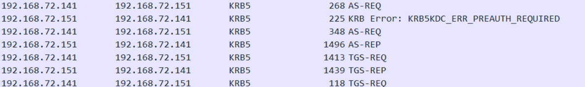
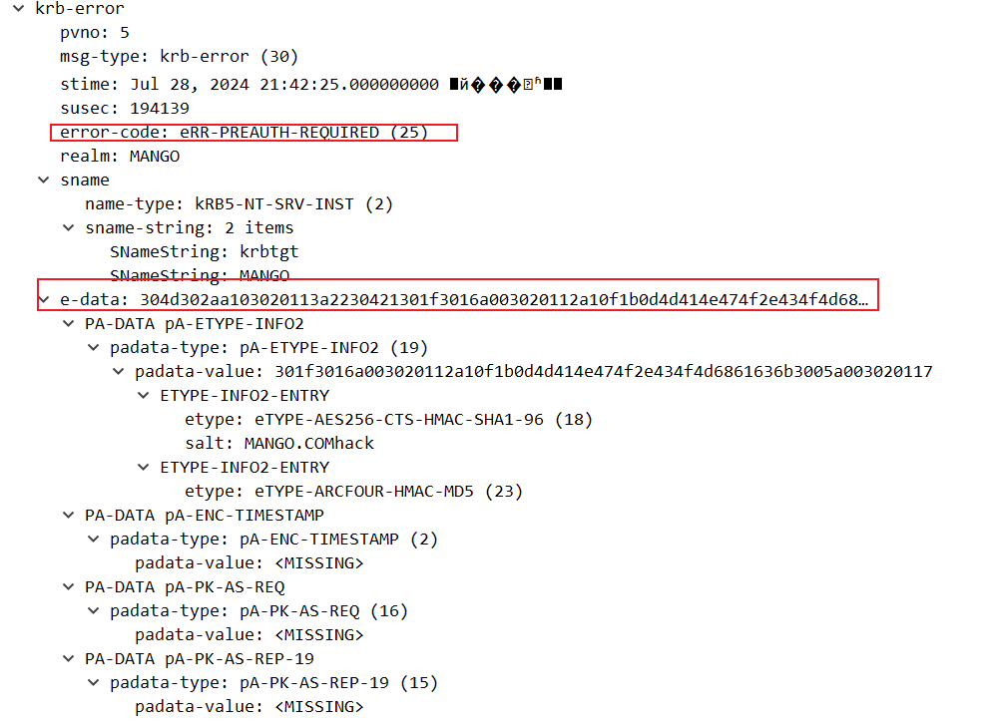
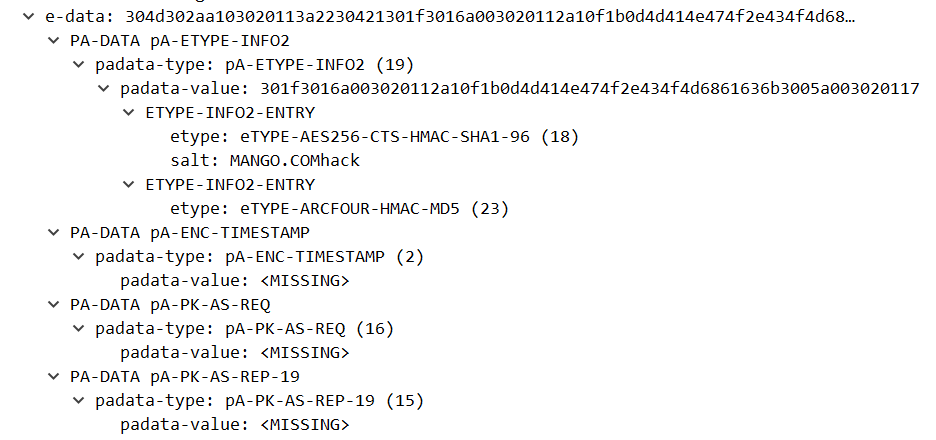
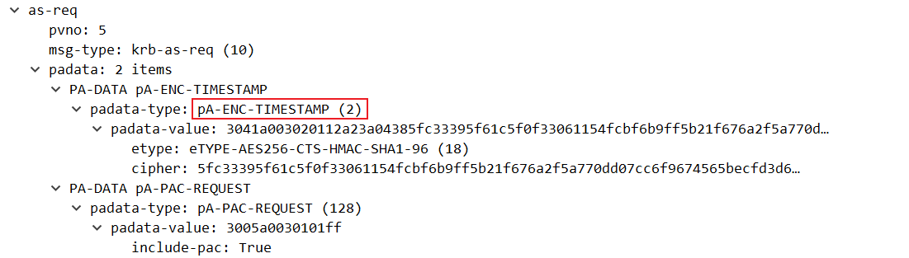
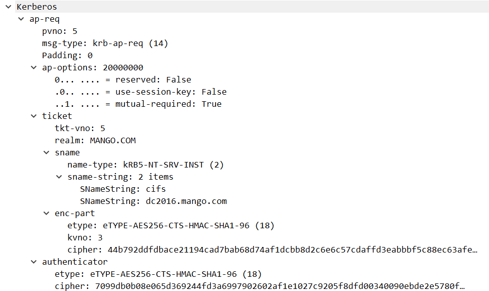
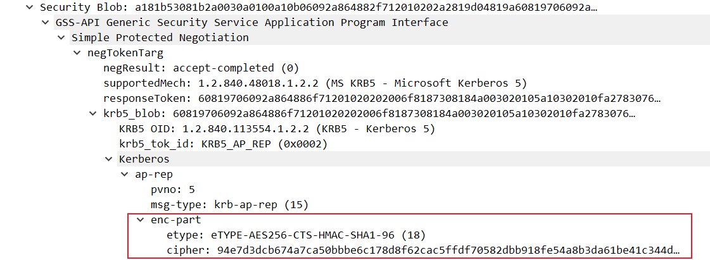

# Kerberos分析

kerberos 的主要步骤如下，重点分析前四步

1. AS-REQ
2. AS-REP
3. TGS-REQ
4. TGS-REP
5. AP-REQ
6. AP-REP

##  AS-REQ

在域控上抓包，查看机器登陆域用户时产生的流量

发现AS-REQ会进行两次，原因是开启了域身份验证，第一次的AS-REQ相比第二次会少一部分

先看这一部分

pvno：5 代表 kerberos 协议的版本号

msg-type 是消息类型

padata：1 item 代表有一个数据项

padata-type: pA-PAC-REQUEST (128)，**这是一个 PAC 的请求**，PAC 用于携带用户的特权信息比如 **用户组、特权**

padata-value: 3005a0030101ff，一个16进制值，后面的ff代表true，跟include-pac对应

然后看req-body

用于指示客户端对KDC提出的要求和期望，KDC-OPTIONS是一个位掩码，每个位代表一个选项，可以是开启（True）或关闭（False）

cname顾名思义client name，包括请求者的用户信息，域

sname包含的是服务端的身份krbtgt和域，till是到期时间，nonce是随机生成数

etype为加密类型，列出多个加密类型，确保客户端和KDC之间至少有一个支持的加密算法

## AS-REP

看到一个krb-err消息，表示需要`eRR-PREAUTH-REQUIRED` 表示需要预身份验证（错误代码25)

e-data是错误消息的附加数据，包含多个预认证数据项（PA-DATA）

padata-type：预认证数据类型，这里是 `pA-ETYPE-INFO2`（类型值19）

patada-type：包含加密类型和盐值

**PA-DATA pA-ENC-TIMESTAMP**

- padata-type: pA-ENC-TIMESTAMP (2)
  - 预认证数据类型，这里是 `pA-ENC-TIMESTAMP`（类型值2）。
- padata-value: 
  - 显示为 `<MISSING>`，表示预期的时间戳数据缺失。通常，这部分会包含客户端加密的时间戳，用于验证客户端的身份。

**PA-DATA pA-PK-AS-REQ**

- padata-type: pA-PK-AS-REQ (16)
  - 预认证数据类型，这里是 `pA-PK-AS-REQ`（类型值16），通常用于公钥加密的预认证。
- padata-value:
  - 显示为 `<MISSING>`，表示预期的公钥认证数据缺失。

**PA-DATA pA-PK-AS-REP-19**

- padata-type: pA-PK-AS-REP-19 (15)
  - 预认证数据类型，这里是 `pA-PK-AS-REP-19`（类型值15），通常用于公钥加密的预认证响应。
- padata-value: 
  - 显示为 `<MISSING>`，表示预期的公钥认证响应数据缺失。

所以接下来会进行第二次的AS-REQ

## AS-REQ(2)

可见带上了TIMESTAMP，其中的cipher：一个用用户密码对时间戳进行加密的值

## AS-REP(2)

kdc会对AS-REQ发送的**TIMESTAMP**进行验证，如果验证通过则会返回两个enc-part

第一个包括了krbtgt密钥生成的TGT用于后续申请TGS，TGT 主要包含Login Session Key、时间戳和 PAC

第二个包括了使用用户hash加密的（**Logon Session Key**）用于客户端和TGS之间的通信。as-reproasting爆破的地方

二者区别以及拓展：

TGT本身是无用的，是krbtgt加密的不透明blob数据，普通用户无法解码，此时第二个数据发挥了作用，他是用户hash进行加密的，包含一组元数据，启动时间，结束时间，票据的更新期限，最重要的是包含一个Session Key会话密钥，TGT blob中也有

那么用户如何使用TGT？用户能使用会话密钥加密的认证器，证明一开始就知道认证交换过程的会话密钥，所以TGT中也有会话密钥，因为TGT要被真正使用的前提是得知会话密钥。TGT续订和S4U请求都需要这个会话密钥

## TGS-REQ

用户拿到TGT票据，使用自己的hash解密AS-REP的**第二个enc-part**加密部分获得Logon Session Key，用Logon Session Key加密用户名、时间戳等信息，和TGT一起向KDC的TGS服务发起请求，请求服务票据

ticket中第一个enc-part的票据部分与AS-REP的是一样的

authenticator是用户名、时间戳和Logon session key加密的

**req-body**如下

请求16server1的host服务

## TGS-REP

TGS服务收到请求后，**通过krbtgt用户的NTML hash解密TGT并且得到Login Session Key**，使用**Logon Session Key**对**authenticator**解密，获取到用户名和时间戳，检查时间戳是否在有效范围内，校对成功会返回ST和加密的**Service Session Key**

第一个enc-part包含了TGS/ST，用ST去访问特定的服务（这里的host）

第二个包含了用**Logon Session Key**加密的**Service Session Key**，用于和服务之间的通信

## AP-REQ

此时在机器上使用如下指令查看AP-REQ

`net use Z: \\dc2016.mango.com\C$ /user:mango.com\administrator`

用户用**Logon Session Key**解密TGS-REP的enc-pat2的加密部分，得到**Service Session Key**，把用户名，时间戳等信息用Service Session Key加密（下面的authenticator），和ST一起发送给目标服务

## AP-REP

服务收到用户的ST，用自己的hash解密得到**Server Session Key**，再用这个key去解密authenticator，进行用户名，时间戳校对

## PAC

在上面的流程里面，只要用户的hash正确，那么就可以拿到TGT，有了TGT，就可以拿到TGS，有了TGS，就可以访问服务，任何一个用户都可以访问任何服务。但是没有证明自己的权限，也就是说，服务端不知道客户端能做什么，是否有权限来访问自己的资源，于是引入了PAC这个概念

PAC(权限属性证书)，会决定用户使用票据的权限，PAC有请求用户的User SID和Group SID，并且被设置有签名来防止篡改，分别是**服务校验和**（服务端的密钥加密）和**KDC校验和**（krbtgt密钥加密）

用户可以凭借TGT向KDC发起针对特定服务的TGS_REQ请求，只要KDC能用krbtgt hash成功解密TGT，就会返回ST，这一步不管用户是否有访问服务的权限，都会返回ST票据，kerberoasting正是基于此，**任何用户都可以得到任意的ST票据**，用户拿ST去请求访问服务，假如服务端不验证PAC，那么请求通过，假如验证PAC则需要KDC进行验证，比对sid以及所在组。

简单说下自己理解的PAC参与到kerberos的过程

AS-REP中，返回TGT的时候会在TGT中附带PAC，下图是两个校验和

Logon信息包括用户名，sid等

然后PAC会在TGS-REP阶段，出现在ST里，最终在AP-REP阶段被KDC进行校验

### MS14-068

微软对PAC的设计加密规定是HMAC系列的checksum算法，这个算法需要密钥，krbtgt和服务端密码，但我们不知道这两个密钥，所以不可能伪造PAC

而在实际情况中，Windows却允许使用任意算法来计算校验和，加密算法由客户端指定，当指定了MD5时，不需要密钥，我们可以修改PAC的内容，然后把校验和设置为PAC的MD5值

之前提过PAC是在AS-REP阶段被放在TGT的，但ms14-068中PAC没有被放在TGT中，而是放在了TGS_REQ数据包的req-body中。KDC在实现上竟然允许这样的构造，也就是说，KDC能够正确解析出放在其它地方（不在TGT）的PAC信息。

KDC会从**authenticator**中提取出**subkey**把PAC信息解密，然后对PAC数据进行MD5加密得到一个值，发现和TGS-REQ发送来的校验和一致，于是通过验证。并且用客户端指定的（MD5）算法重新使用Server_Key和KDC_Key在PAC尾部生成签名，把Session key用subkey加密，组合成一个新的TGT返回给客户端

参考

https://y4er.com/posts/kerberos-pac/

https://daiker.gitbook.io/windows-protocol/kerberos/3

https://loong716.top/posts/Kerberos/

